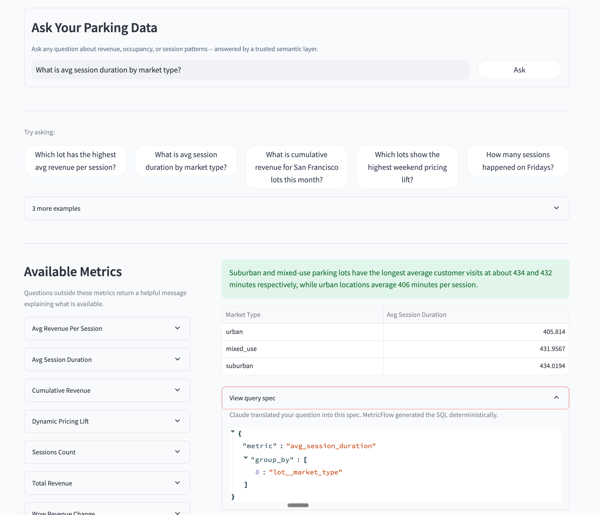

# Parking Portfolio Intelligence

A dbt semantic layer on raw parking event data, with a Streamlit app for portfolio analytics and natural language querying.


---

## Live Demo

### Portfolio Dashboard:


--------------------------------------------------------------

### Ask Data:


--------------------------------------------------------------

**Live app:** [Streamlit Cloud URL -- add after deployment]

---

## The Problem

AirGarage replaces fragmented parking operations with a data-rich OS for property owners. Their Intelligence Dashboard gives owners real-time occupancy, revenue, and pricing signals, but that only works if the underlying data is well-defined and trustworthy. Parking data is messy at the source: LPR cameras fire separate entry and exit events, camera misfires create duplicate records, and properties may have incomplete metadata.

This project models the full data layer: raw camera events cleaned, tested, and exposed as named business metrics that a dashboard or an AI can query reliably. The dbt Semantic Layer is not just internal tooling -- it is the data contract between raw events and everything downstream: owner dashboards, pricing algorithms, and natural language queries.

---

## Stack

| Layer | Technology |
|-------|-----------|
| Transformation | dbt Core 1.8, MetricFlow 0.209 |
| Warehouse | DuckDB 1.1.3 (demo), Snowflake-compatible |
| Semantic Layer | dbt Semantic Layer (MetricFlow engine) |
| NL Query | Anthropic Claude API, MetricFlow CLI |
| App | Streamlit, Plotly |
| Language | Python 3.12, SQL |

---

## Architecture

```
Raw LPR Events  (3 messy CSVs)
  entry + exit as separate rows per camera trigger
  duplicate triggers, NULL capacity, inconsistent casing
        |
        v
  dbt Staging         clean + flag (bad rows retained, never dropped)
        |
        v
  dbt Intermediate    pair entry + exit events into sessions
                      ASOF JOIN match on lot_id + license_plate
        |
        v
  dbt Marts
  ├── fct_sessions       incremental fact, 18+ dbt tests
  ├── dim_lots           capacity tier, city, market_type, lot_name
  ├── dim_time           time spine for cumulative + offset metrics
  ├── mart_lot_daily     pre-aggregated: occupancy rate, turnover rate
  └── dbt Semantic Layer 7 metrics, 12 dimensions, 4 metric types
        |
        v
  Streamlit App
  ├── Portfolio Dashboard    queries mart_lot_daily directly (fast reads)
  └── Ask Your Data          NL question -> metric spec -> MetricFlow -> DuckDB
```

[DIAGRAM: data pipeline architecture -- raw events to Streamlit app]

---

## Data Model

The project follows a star schema pattern centered on parking sessions.

[SCREENSHOT: dbt docs lineage graph showing all models]

**Core models:**

| Model | Type | Grain | Approx rows |
|-------|------|-------|-------------|
| `fct_sessions` | Fact (incremental) | one per valid session | ~900 |
| `mart_lot_daily` | Aggregated fact | lot x calendar day | ~720 |
| `dim_lots` | Dimension | one per lot | 8 |
| `dim_time` | Dimension (time spine) | one per calendar day | ~150 |

**Star schema joins:**

- `fct_sessions` joins to `dim_lots` via `lot_id` (many-to-one)
- `fct_sessions` joins to `dim_time` via `session_date` (many-to-one)
- `mart_lot_daily` joins to `dim_lots` via `lot_id` for occupancy calculations

---

## Transformation Logic

### Staging: flag at source, never drop

Staging models standardize casing and types, then add boolean flags for data quality issues. No rows are removed. The full audit trail stays queryable in the intermediate layer; `fct_sessions` applies the explicit filters downstream.

```sql
-- stg_parking_events.sql (excerpt)
select
    cast(lower(event_type) as varchar)                  as event_type,
    cast(lower(nullif(payment_method, '')) as varchar)   as payment_method,
    cast(amount_charged as double)                       as amount_charged,
    amount_charged is null                               as is_amount_missing
from source
```

### Intermediate: session assembly

LPR cameras fire one event per trigger. Entry and exit are separate rows. The intermediate model pairs them using an ASOF LEFT JOIN that matches each ENTRY to the nearest future EXIT for the same lot and license plate. A backward pass catches clock-sync bugs where exit timestamps precede entry timestamps by up to 30 minutes.

```sql
-- int_sessions.sql (excerpt: forward pass)
select
    e.entry_event_id,
    x.exit_event_id,
    e.lot_id,
    e.license_plate,
    e.entry_ts,
    x.exit_ts,
    x.amount_charged
from entries e
asof left join exits x
    on  e.lot_id        = x.lot_id
    and e.license_plate = x.license_plate
    and e.entry_ts     <= x.exit_ts
```

### Marts: explicit filter contracts and incremental loading

`fct_sessions` materializes as an incremental model using `entry_ts` as the watermark. Flagged rows are filtered explicitly rather than silently -- if flag logic changes, the impact on session counts is immediately visible in a diff.

```sql
{{ config(
    materialized='incremental',
    unique_key='session_id',
    on_schema_change='append_new_columns'
) }}

with sessions as (
    select * from {{ ref('int_sessions') }}
    
    where entry_ts > (
        select coalesce(max(entry_ts), '1900-01-01'::timestamp)
        from {{ this }}
    )
    
),
```

Division operations use a reusable `safe_divide` macro instead of inline `CASE WHEN` logic:

```sql
-- mart_lot_daily.sql
round({{ safe_divide('peak_concurrent_sessions', 'capacity') }}, 4)
    as occupancy_rate
```

---

## dbt Practices

### Macros

`safe_divide(numerator, denominator)` returns NULL when the denominator is zero or NULL. Used in `mart_lot_daily` for occupancy_rate and turnover_rate. Prevents division-by-zero errors that would otherwise require repeated inline `CASE WHEN` blocks.

```sql

    CASE
        WHEN {{ denominator }} = 0 OR {{ denominator }} IS NULL THEN NULL
        ELSE {{ numerator }}::double / {{ denominator }}
    END

```

### Testing

18+ dbt schema tests across all mart models, plus 3 custom SQL tests:

- `assert_no_negative_duration` -- confirms `fct_sessions` filter caught all negative-duration sessions
- `assert_no_revenue_on_entry_events` -- validates that ENTRY events never carry a charge
- `assert_occupancy_not_exceeding_capacity` -- flags lots where `occupancy_rate > 1.05` (5% tolerance)

### Materialization strategy

| Model | Materialization | Reason |
|-------|----------------|--------|
| `fct_sessions` | incremental (merge) | Production pattern for continuous LPR data |
| `mart_lot_daily` | table | Pre-aggregated, full rebuild is fast and safe |
| `dim_lots` | table | Small dimension, rarely changes |
| `dim_time` | table | Static reference data |

---

## dbt Semantic Layer

Metrics are defined once in `marts.yml` and served consistently to the dashboard, the NL query tab, and any connected BI tool. No metric logic lives in application code.

**MetricFlow-managed metrics** (SQL generated deterministically):

| Metric | Definition | Business Use |
|--------|-----------|--------------|
| `total_revenue` | `sum(amount_charged)` on valid sessions | NOI tracking |
| `sessions_count` | count of valid sessions | Demand signal |
| `avg_session_duration` | avg session length in minutes | Space planning |
| `avg_revenue_per_session` | `total_revenue / sessions_count` | Yield analysis |
| `dynamic_pricing_lift` | weekend avg revenue / weekday avg revenue | Pricing model input |
| `cumulative_revenue` | running total of revenue within a time window | Monthly target tracking |
| `wow_revenue_change` | current week revenue minus prior week revenue | Week-over-week trend detection |

**Pre-computed in `mart_lot_daily`** (not in the semantic layer):

| Column | Definition | Why pre-computed |
|--------|-----------|-----------------|
| `occupancy_rate` | peak concurrent sessions / capacity | Requires a sweep-line window function over event timestamps + a join to `dim_lots` for capacity. MetricFlow expects additive measures on a single model. |
| `turnover_rate` | total sessions / capacity | Same: depends on capacity from the dimension table. |

### Metric types

MetricFlow supports four metric types. This project uses all four:

| Type | Metric(s) | What it enables |
|------|----------|-----------------|
| simple | `total_revenue`, `sessions_count`, `avg_session_duration` | Direct aggregations on a single measure |
| ratio | `avg_revenue_per_session`, `dynamic_pricing_lift` | Cross-measure division, filtered numerator/denominator |
| cumulative | `cumulative_revenue` | Revenue trajectory within a time window |
| derived (offset) | `wow_revenue_change` | Period-over-period comparison using time spine |

Cumulative and derived offset metrics require a time spine (`dim_time`) so MetricFlow can materialize date-aligned windows. Without it, these metric types cannot be defined.

**Available dimensions** (MetricFlow resolves the `fct_sessions` + `dim_lots` join automatically):

| Source | Dimensions |
|--------|-----------|
| `fct_sessions` | `session_date`, `lot_id`, `time_of_day_bucket`, `day_of_week`, `is_weekend`, `payment_method`, `has_local_event` |
| `dim_lots` via lot entity | `lot_name`, `city`, `state`, `market_type`, `lot_capacity_tier` |

---

## Why dbt Semantic Layer, Not Text-to-SQL

Two approaches exist for natural language analytics on structured data.

**Text-to-SQL:** Claude reads the schema and writes raw SQL. Flexible -- it can answer almost any question. The problem is correctness: Claude can produce a syntactically valid query with a wrong join or a misapplied filter that returns plausible-looking but incorrect results. As dbt Labs documented in their 2026 benchmark: text-to-SQL will "cheerfully give you a wrong number."

**dbt Semantic Layer (this project):** Claude translates the question into a structured spec -- one metric name and a list of dimension names. MetricFlow takes that spec and generates the SQL deterministically. Claude never writes a `JOIN` clause. If Claude picks the correct metric and dimensions, the SQL is guaranteed correct. If the question is out of scope, the app returns an explicit error rather than a plausible-looking wrong answer.

The tradeoff is coverage: the semantic layer only answers questions within its 7-metric, 12-dimension scope. That is the constraint. The benefit is trust -- every result is computed the same way every time, and that logic is readable in `marts.yml`.

From dbt Labs' 2026 benchmark: for questions within the semantic layer's scope, tested models returned correct results 100% of the time. Text-to-SQL on the same questions: 64.5%.

Reference: https://docs.getdbt.com/blog/semantic-layer-vs-text-to-sql-2026

---

## Data Quality

| Issue | Where it appears | How detected | How handled |
|-------|-----------------|-------------|-------------|
| Duplicate ENTRY events | Camera misfire | `is_duplicate_entry` flag in `int_sessions` | Filtered in `fct_sessions` |
| EXIT with no ENTRY | Pre-activation vehicles | `is_orphaned_exit` flag | Excluded from `fct_sessions` |
| ENTRY with no EXIT | Drive-offs / still parked | `is_orphaned_entry` flag | Excluded from `fct_sessions` |
| Negative duration | Timestamp clock sync bug | `is_negative_duration` flag | Filtered; caught by custom dbt test |
| Unknown `lot_id` | Decommissioned lot | No join match to `dim_lots` | Drops from `fct_sessions` naturally |
| NULL capacity | No record on file | `is_capacity_missing` flag in `dim_lots` | Excluded from occupancy rate; shown as `'unknown'` tier |

---

## Key Engineering Decisions

**1. Entry and exit as separate source rows**

LPR cameras fire one event per trigger. The raw source deliberately mirrors this: `raw_parking_events.csv` stores one row per camera trigger, not one row per session. The session assembly happens in `int_sessions.sql` via an ASOF JOIN that matches each ENTRY to the next EXIT for the same lot and license plate. This keeps the source layer faithful to how real LPR systems emit data, and isolates the join logic in one place where it can be tested.

**2. Flag bad rows, never drop them**

Staging and intermediate models add boolean flags (`is_orphaned_entry`, `is_duplicate_entry`, `is_negative_duration`) but retain every row. `fct_sessions` applies the filters explicitly. The full flagged history stays queryable in `int_sessions` for audit purposes. If flag logic changes, the impact on downstream counts is immediately visible in a diff rather than silently dropping rows.

**3. Occupancy rate lives in the mart, not the semantic layer**

MetricFlow is designed for additive measures: `sum()`, `count()`, `avg()`. Occupancy rate requires a sweep-line over timestamped events to find peak concurrency, then a division by capacity from a separate dimension table. Neither step fits MetricFlow's aggregation model. Pre-computing it in `mart_lot_daily` keeps the semantic layer honest about what it can express. Safe division is handled via a reusable `safe_divide` macro rather than inline `CASE WHEN` logic repeated across models.

---

## Current Limitations

- **Single-question scope.** One question maps to one MetricFlow query and one result. Complex questions like "analyze underperforming lots and suggest pricing changes" require multiple chained queries with reasoning between steps. The current design does not support that. The natural extension is an MCP server wrapping MetricFlow as callable tools -- see Future Extensions.
- **Synthetic data.** 8 lots, 90 days (Jan-Mar 2024). Patterns are realistic but not real operational data.
- **DuckDB in demo.** Chosen for zero-infrastructure deployment to Streamlit Cloud. All dbt models and MetricFlow definitions are warehouse-agnostic -- only `profiles.yml` changes for Snowflake.

---

## How to Run Locally

```bash
git clone <repo>
python -m venv venv && source venv/bin/activate
pip install -r requirements.txt
python generate_data/generate_raw_data.py
cp data/*.csv dbt_project/seeds/
cd dbt_project && dbt seed && dbt run && dbt test && cd ..
streamlit run app/streamlit_app.py
```

On first load, the app detects that `warehouse.duckdb` does not exist and runs the full pipeline automatically. Subsequent loads skip that step.

---

## Future Extensions

- **MCP server wrapping MetricFlow as callable tools.** The single-question limitation above is the most important gap. An MCP server exposing each metric as an individually callable tool lets Claude chain 3-4 queries with reasoning between steps -- the pattern required for portfolio-level analysis questions.

- **Real-time ingestion via Snowpipe Streaming or Kafka.** Replacing seeds with a streaming consumer is the gap between demo and production architecture: it tests whether the staging layer handles schema drift and late-arriving events -- which is how LPR data actually arrives.

- **Reverse ETL via Polytomic.** MetricFlow metrics are currently only accessible through the Streamlit app. Polytomic would push computed metrics back to owner-facing systems after each dbt run, without requiring owners to log into another tool.

- **dbt Cloud with Semantic Layer API.** Direct API access from Hex or Tableau removes the Streamlit dependency and lets any connected BI tool query named metrics with the same governance guarantees -- without each team maintaining their own MetricFlow subprocess wrapper.
